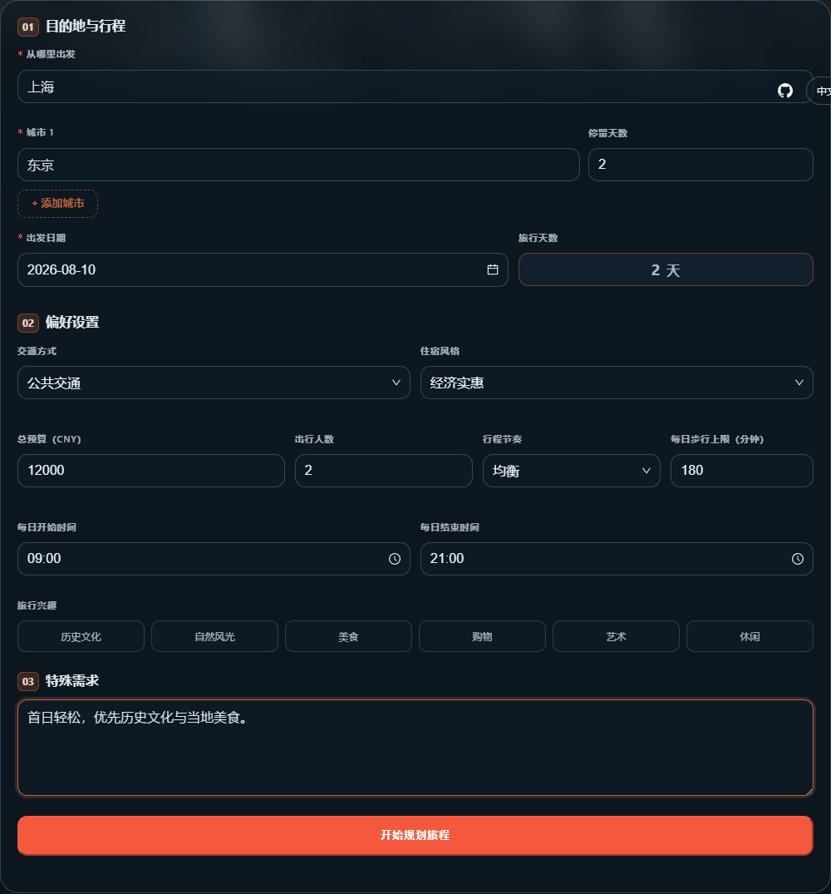
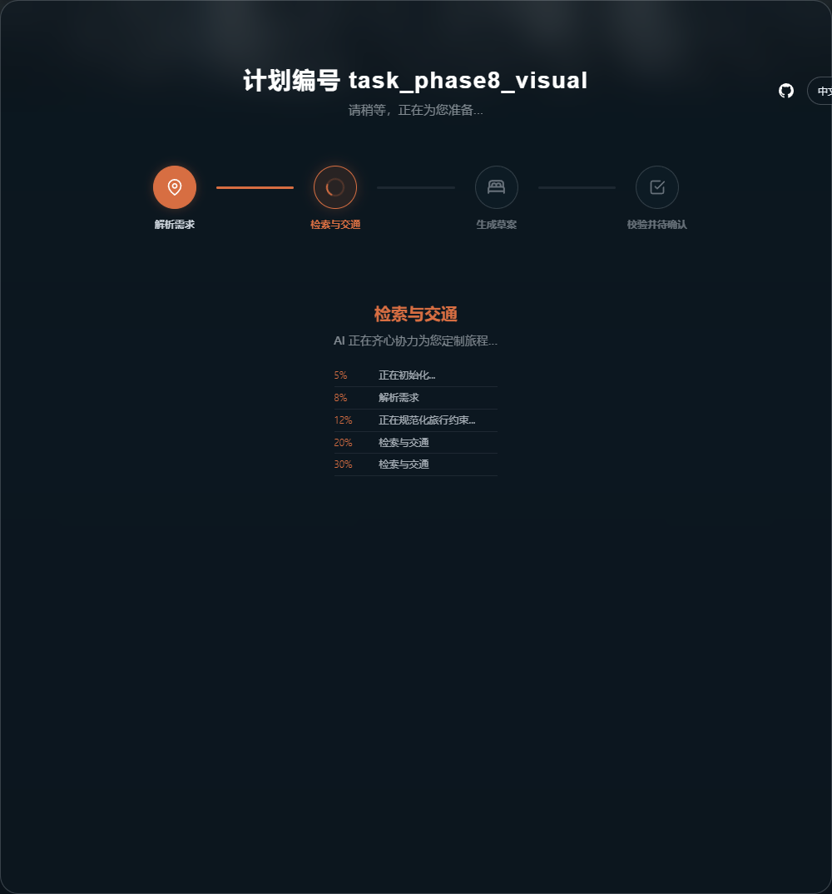
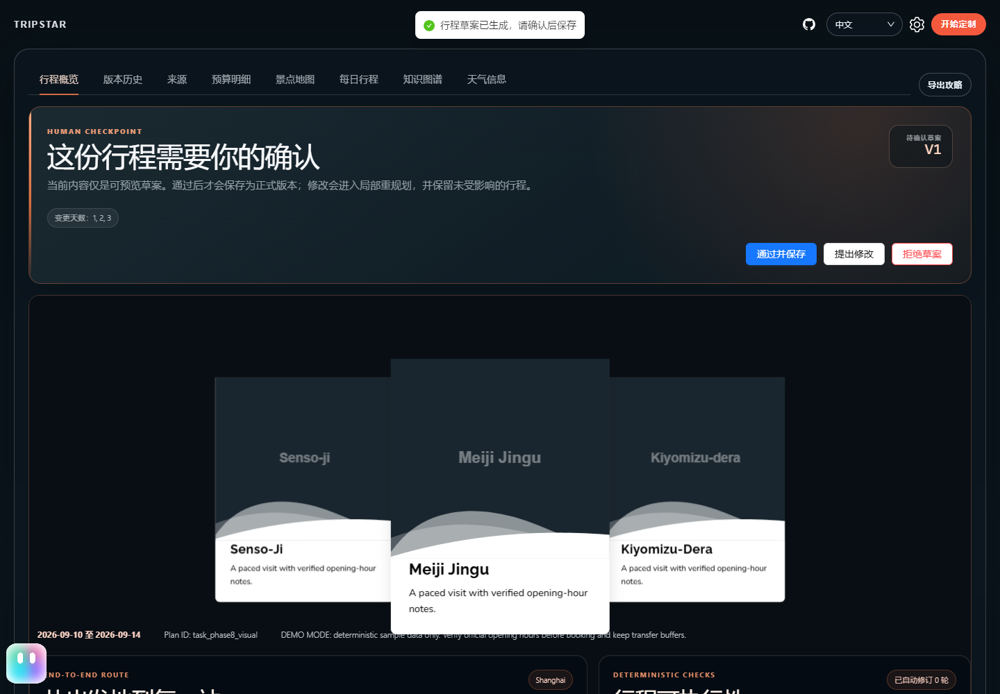
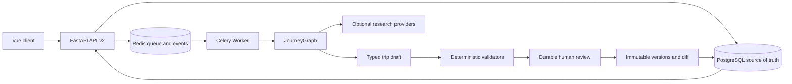

# JourneyOps

A durable, source-backed, validated and recoverable travel execution agent with scoped replanning.

[中文](README.md) | [日本語](README_ja.md) | [Architecture](docs/ARCHITECTURE.md) | [API v2](docs/API_V2.md) | [Evaluation](docs/EVALUATION_REPORT.md)

## One-Minute Overview

JourneyOps incrementally evolves the upstream [1sdv/TripStar](https://github.com/1sdv/TripStar) itinerary generator into a durable task system. FastAPI accepts requests, PostgreSQL owns canonical state, Celery runs a resumable JourneyGraph, Redis carries jobs and events, and Vue exposes real node progress, sources, transport, deterministic validation, human review, version diffs and rollback.

The project demonstrates:

- Long-running work survives API and Worker restarts instead of living in process memory.
- The LLM creates typed drafts while code validates dates, timelines, routes, budgets, opening hours and intensity.
- Initial plans and scoped replans require human approval; versions are immutable and rollback appends a version.
- Search, map and community providers may fail safely through typed errors, fallbacks and diagnostic IDs.
- Server API keys, Cookies and model credentials never enter browser responses or application logs.

## Keyless Demo

Docker Desktop or Docker Engine with Compose v2 is the only prerequisite. No model, map or community keys are required.

```powershell
Copy-Item .env.demo.example .env.demo
docker compose --env-file .env.demo -f docker-compose.yaml -f docker-compose.demo.yaml up --build -d
```

Open `http://127.0.0.1:17862`. Demo mode uses deterministic structured data while still exercising JourneyGraph, durable tasks, deterministic validation and human review. It makes no external model, search, map Web Service or Xiaohongshu calls.

```powershell
curl.exe http://127.0.0.1:17862/health/live
curl.exe http://127.0.0.1:17862/health/ready
docker compose --env-file .env.demo -f docker-compose.yaml -f docker-compose.demo.yaml down
```

See [Deployment](docs/DEPLOYMENT.md) for real providers, staging isolation, HTTPS, backup and restore.

## Demo Screenshots

| Complete constraints | Real node progress |
| --- | --- |
|  |  |
| Human approval boundary | Immutable version history |
|  |  |

The screenshots use the current frontend production code and a deterministic sanitized Phase 8 fixture. The
isolated Oracle demo stack was separately verified through the real API, Worker, JourneyGraph, approval and
persistence path.

## Runtime Flow



The complete Before/After diagrams and failure boundaries are in [Architecture](docs/ARCHITECTURE.md).

## Reproducible Evaluation

The pinned `journeyops-travel-v1.0.0` dataset has 36 normal and fault scenarios covering schema, budget, time, sources, retries, recovery, scoped replanning, injection defenses, concurrency and model budgets.

| Engine | Passed | Pass rate | Sanitized latency fixture | Sanitized cost fixture |
| --- | ---: | ---: | ---: | ---: |
| legacy | 28 / 36 | 77.78% | 120,000 ms | USD 6.84 |
| journey_graph | 35 / 36 | 97.22% | 91,000 ms | USD 5.04 |

Latency and cost are deterministic sanitized fixtures, not claims about current provider performance or pricing. The [Evaluation Report](docs/EVALUATION_REPORT.md) preserves metric definitions and all known failures.

## Stack

Python 3.10, FastAPI, Pydantic v2, SQLAlchemy 2, Alembic, PostgreSQL 16, Redis 7, Celery, LangGraph, Vue 3, TypeScript, Vite and Docker Compose.

## Documentation

- [Phase 8 acceptance](docs/PHASE_8_ACCEPTANCE.md)
- [API v2](docs/API_V2.md)
- [Architecture and failure policy](docs/ARCHITECTURE.md)
- [Deployment and staging](docs/DEPLOYMENT.md)
- [Backup, restore and rollback](docs/BACKUP_RESTORE_ROLLBACK.md)
- [Security boundaries](docs/SECURITY.md)
- [3–5 minute demo script](docs/DEMO_SCRIPT.md)
- [Changes from upstream](docs/CHANGELOG_FROM_UPSTREAM.md)

## Upstream and License

This project is a substantial derivative of [1sdv/TripStar](https://github.com/1sdv/TripStar). It preserves the upstream attribution and GPL-2.0 license. JourneyOps additions, including durable tasks, JourneyGraph, evidence, deterministic validation, human review, versioning, evaluation, observability, security and deployment changes, are listed in [Changes from Upstream](docs/CHANGELOG_FROM_UPSTREAM.md).

Licensed under [GPL-2.0](LICENSE).
