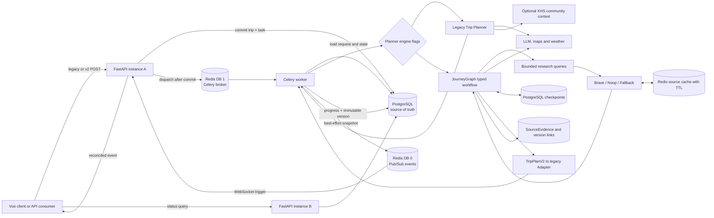
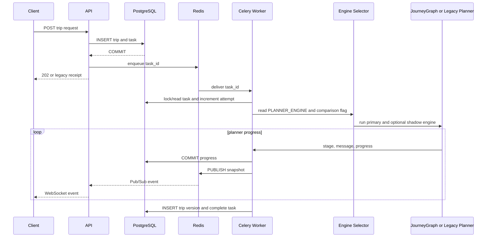
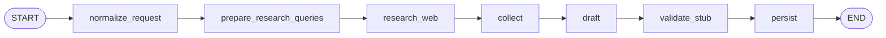

# JourneyOps Architecture

## Phase 4 Runtime

## Persistence Boundaries

- `trips` stores the canonical request and idempotency digest.
- `trip_tasks` stores execution status, progress, attempts, cancellation and terminal errors.
- `trip_versions` stores immutable outputs with unique `(trip_id, version)`. Phase 3 adds planner engine,
  primary/comparison role, schema version and optional native `TripPlanV2` payload metadata.
- `source_evidence` deduplicates source metadata and explicit `unknown` markers. `trip_source_links` binds
  evidence to an immutable trip version, so a later refresh cannot silently rewrite historical output.
- LangGraph checkpoint tables store resumable typed graph state by durable task id. Their serializer rejects
  types outside the explicit allowlist when `LANGGRAPH_STRICT_MSGPACK=true`.
- Redis broker messages and Pub/Sub events may be lost or duplicated; database constraints and Worker
  transitions make redelivery safe.
- `backend/data/trip_tasks/*.json`, process dictionaries and process-local WebSocket queues are no
  longer used as task state.

## Execution Sequence

## JourneyGraph

The phase 4 graph adds bounded research before collection while retaining deterministic checkpoints:

`prepare_research_queries` creates five deterministic queries per destination: opening hours, closures,
reservations, events and travel tips. The first four are critical. `research_web` records sanitized Provider
issues and metrics without stopping the graph; unanswered critical queries become explicit `unknown`
evidence. `draft` validates provider-native JSON as `TripPlanV2`, then replaces any model-provided evidence
with graph-owned evidence. The Adapter carries the same evidence into the legacy frontend response.

Official trust is assigned only through configured domain allowlists or recognized government suffixes.
Web evidence is cached in Redis using `SOURCE_CACHE_TTL_SECONDS`; XHS is optional community context and is
disabled unless both `XHS_ENABLED=true` and a Cookie are configured.

## Failure Policy

- API failure before broker dispatch leaves an explicit failed task. If the broker accepted a message
  but the API could not persist its broker id, the task remains queued for automatic recovery.
- Worker uses late acknowledgement, worker-loss rejection, a visibility timeout longer than the hard
  task limit, and a cross-thread renewable Redis execution lock. Redelivery reuses the task row and
  immutable version.
- Worker startup and its periodic recovery loop scan undispatched, stale queued/retrying, and stale
  processing tasks. A row lock revalidates each candidate, a persisted recovery claim prevents parallel
  dispatch, and a live execution lock protects slow work. Work below its attempt limit is requeued;
  exhausted work becomes `failed` with `worker_lost`.
- Cancellation is immediate for queued work and cooperative for an executing Planner.
- Shadow comparison errors are redacted and do not fail a successful primary run. A primary failure cancels
  outstanding comparison work.
- Web research maps authentication, rate-limit, timeout, empty and malformed responses to fixed safe codes.
  One Provider failure falls through to the next Provider; when none succeeds, planning continues with
  `unknown` evidence.
- XHS failures return a language-specific fallback context. Raw Cookie values and upstream exception text do
  not enter graph state, API responses or logs.

## Health

- API `/health/live`: process liveness only.
- API `/health/ready`: data directory, PostgreSQL and Redis.
- Compose PostgreSQL: `pg_isready`.
- Compose Redis: `redis-cli ping`.
- Compose Worker: Celery `inspect ping` against the named worker.
