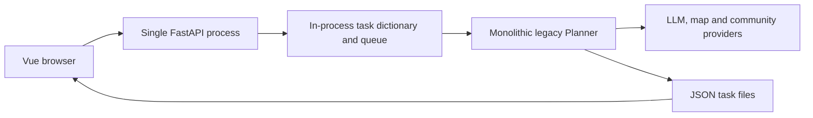
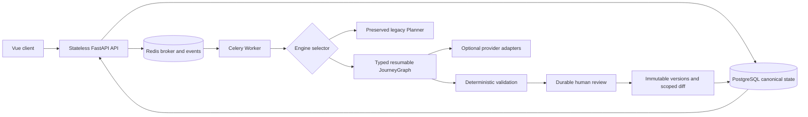
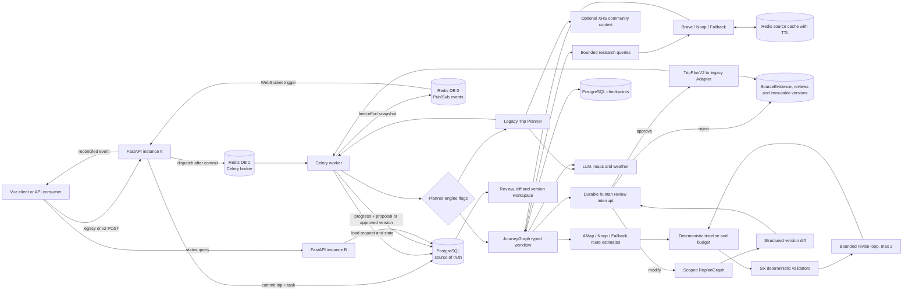
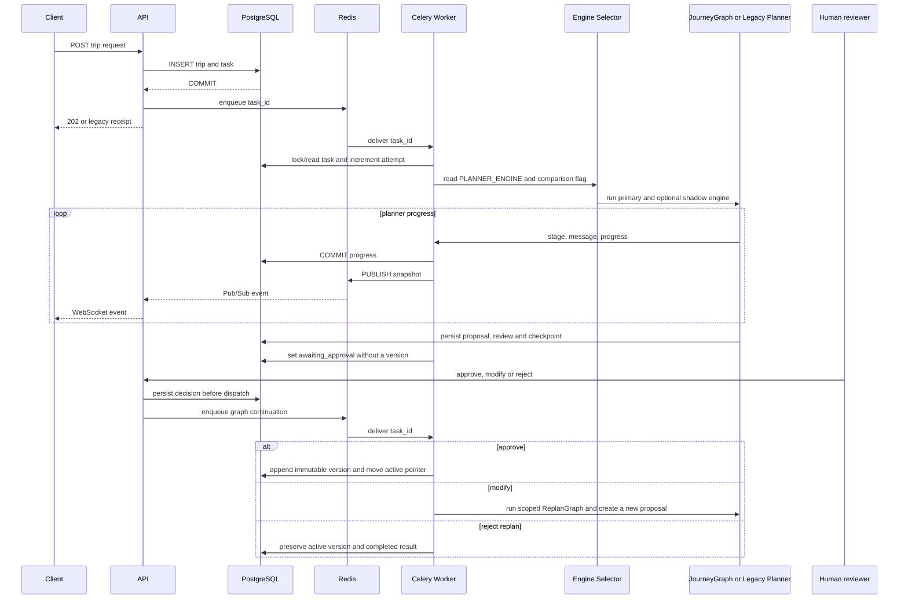
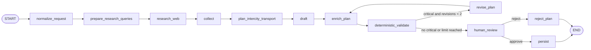
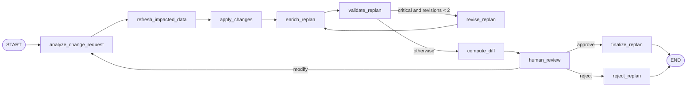

# JourneyOps Architecture

## Before And After

### Before: Upstream Runtime

The upstream path coupled HTTP availability, task execution and mutable JSON state to one process. A restart
could interrupt work, external failures crossed component boundaries as untyped text, and generated values were
not independently validated before presentation.

### After: JourneyOps Runtime

The migration is incremental: the legacy Planner remains available behind a feature flag, while JourneyGraph
adds typed state, checkpoints, evidence, program-owned validation and durable review without rewriting the
legacy implementation.

## Phase 8 Runtime

## Persistence Boundaries

- `trips` stores the canonical request, idempotency digest and current `active_version` pointer.
- `trip_tasks` stores execution status, progress, attempts, cancellation, review linkage and terminal errors.
- `trip_versions` stores immutable outputs with unique `(trip_id, version)`. Phase 3 adds planner engine,
  primary/comparison role, schema version and optional native `TripPlanV2` payload metadata.
- The phase 5 native payload owns the normalized origin, route estimates, intercity transport options,
  contiguous schedule items, recalculated budget, validation report and revision count. These values remain
  part of the immutable version rather than mutable process state.
- `source_evidence` deduplicates source metadata and explicit `unknown` markers. `trip_source_links` binds
  evidence to an immutable trip version, so a later refresh cannot silently rewrite historical output.
- `trip_reviews` stores initial/replan/rollback workflow type, pending proposal, decision, impact scope,
  structured diff, reason, sources and validation report. A proposal is durable but is not a version.
- Phase 6 version rows also store parent version, review id, role, reason, source list and validation report.
  Approval and rollback append rows; they never rewrite historical payloads.
- LangGraph checkpoint tables store resumable typed graph state by durable task id. Their serializer rejects
  types outside the explicit allowlist when `LANGGRAPH_STRICT_MSGPACK=true`.
- Redis broker messages and Pub/Sub events may be lost or duplicated; database constraints and Worker
  transitions make redelivery safe.
- `backend/data/trip_tasks/*.json`, process dictionaries and process-local WebSocket queues are no
  longer used as task state.

## Execution Sequence

## JourneyGraph

The phase 6 graph retains phase 5 planning and adds a durable review decision before persistence:

`prepare_research_queries` and `research_web` retain the phase 4 evidence policy. After collection,
`plan_intercity_transport` estimates the origin-to-first-city and between-city legs through the configured
route Provider and creates at most two deterministic planning options per leg with exactly one recommendation.
AMap supplies driving distance and duration as route evidence; train and flight durations/costs are planning
estimates, not schedules, availability or live fares.

`draft` validates provider-native JSON as `TripPlanV2`, then restores request-owned identity fields and
graph-owned evidence. `enrich_plan` creates unique schedule items that close each requested daily window and
recalculates all budget components. `deterministic_validate` runs structure/date, time, route, budget, opening
hours and intensity checks. A critical issue loops through `revise_plan` at most twice; unresolved issues are
shown instead of being hidden. The review node persists the proposal and interrupts the task. Only approval
routes to `persist`; initial rejection exits without a version. The Adapter carries approved fields into the
legacy frontend response.

## ReplanGraph

Impact analysis explicitly identifies day indexes, fields and whether research, routing, timeline or budget
must be refreshed. Unaffected days are copied with stable identifiers. The graph validates the proposal and
computes a structured diff before interrupting. Approval appends a new version; no-op approval returns `409`.
Rollback copies a historical payload into a new `rollback` version so history remains immutable.

Official trust is assigned only through configured domain allowlists or recognized government suffixes.
Web evidence is cached in Redis using `SOURCE_CACHE_TTL_SECONDS`; XHS is optional community context and is
disabled unless both `XHS_ENABLED=true` and a Cookie are configured.

## Failure Policy

- API failure before broker dispatch leaves an explicit failed task. If the broker accepted a message
  but the API could not persist its broker id, the task remains queued for automatic recovery.
- Worker uses late acknowledgement, worker-loss rejection, a visibility timeout longer than the hard
  task limit, and a cross-thread renewable Redis execution lock. Redelivery reuses the task row and
  immutable version.
- Worker startup and its periodic recovery loop scan undispatched, stale queued/retrying, and stale
  processing tasks. A row lock revalidates each candidate, a persisted recovery claim prevents parallel
  dispatch, and a live execution lock protects slow work. Work below its attempt limit is requeued;
  exhausted work becomes `failed` with `worker_lost`.
- Cancellation is immediate for queued work and cooperative for an executing Planner.
- Shadow comparison errors are redacted and do not fail a successful primary run. A primary failure cancels
  outstanding comparison work.
- Web research maps authentication, rate-limit, timeout, empty and malformed responses to fixed safe codes.
  One Provider failure falls through to the next Provider; when none succeeds, planning continues with
  `unknown` evidence.
- Route lookup maps Provider failure to a safe unavailable estimate and deterministic fallback options. Raw
  upstream payloads and credential-bearing request URLs do not enter graph state, API responses or INFO logs.
- Validation is program-owned. The LLM cannot override request identity, computed route metadata, timeline,
  budget totals, validation results or the two-revision limit.
- Review decisions are committed before continuation is dispatched. PostgreSQL review rows and LangGraph
  checkpoints survive API/Worker restarts; repeated delivery reuses the same decision and version constraints.
- Replan rejection preserves the active version and completed result. A no-op diff cannot be approved, and a
  rollback always appends a new version rather than mutating the target historical row.
- XHS failures return a language-specific fallback context. Raw Cookie values and upstream exception text do
  not enter graph state, API responses or logs.

## Health

- API `/health/live`: process liveness only.
- API `/health/ready`: data directory, PostgreSQL and Redis.
- Compose PostgreSQL: `pg_isready`.
- Compose Redis: `redis-cli ping`.
- Compose Worker: Celery `inspect ping` against the named worker.
