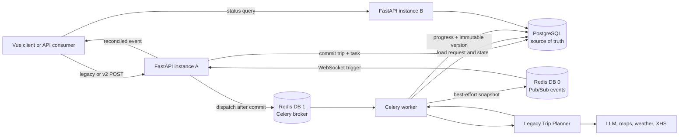
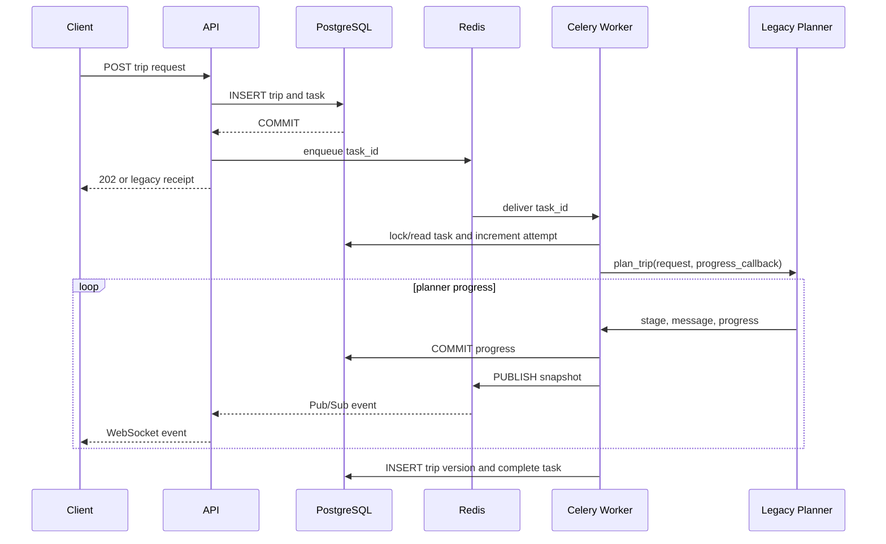

# JourneyOps Architecture

## Phase 2 Runtime

## Persistence Boundaries

- `trips` stores the canonical request and idempotency digest.
- `trip_tasks` stores execution status, progress, attempts, cancellation and terminal errors.
- `trip_versions` stores immutable outputs with unique `(trip_id, version)`.
- Redis broker messages and Pub/Sub events may be lost or duplicated; database constraints and Worker
  transitions make redelivery safe.
- `backend/data/trip_tasks/*.json`, process dictionaries and process-local WebSocket queues are no
  longer used as task state.

## Execution Sequence

## Failure Policy

- API failure after commit but before dispatch leaves an explicit failed task; the same request is
  queryable and can be retried.
- Worker uses late acknowledgement, worker-loss rejection, a visibility timeout longer than the hard
  task limit, and a renewable Redis execution lock. Redelivery reuses the task row and immutable version.
- Worker startup scans undispatched and stale processing tasks. Work below its attempt limit is
  requeued; exhausted work becomes `failed` with `worker_lost`.
- Cancellation is immediate for queued work and cooperative for an executing Planner.

## Health

- API `/health/live`: process liveness only.
- API `/health/ready`: data directory, PostgreSQL and Redis.
- Compose PostgreSQL: `pg_isready`.
- Compose Redis: `redis-cli ping`.
- Compose Worker: Celery `inspect ping` against the named worker.
