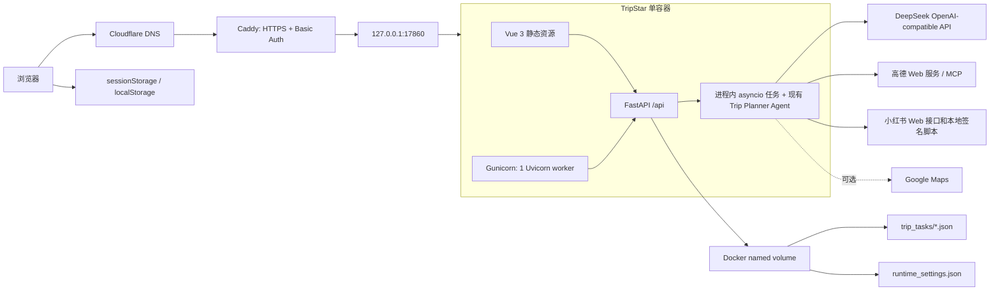
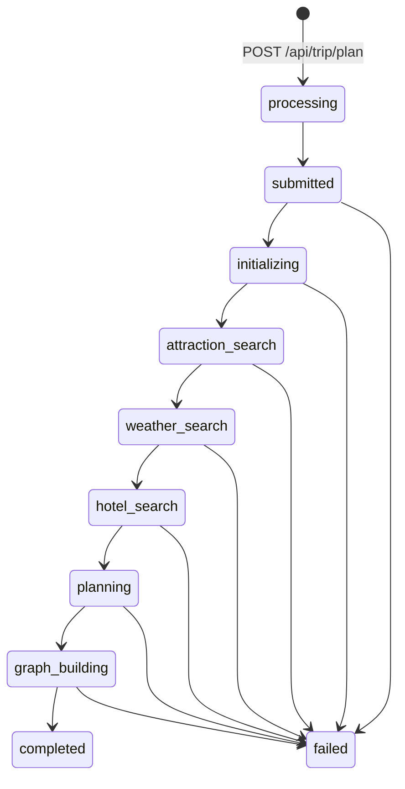

# TripStar Baseline Audit

审计日期：2026-08-06

生产主机：Oracle Ubuntu VPS（主机标识已脱敏）

审计基线提交：`96b9c5e764208e50761695b2daec60889ff817f9`

范围：仅阶段 0，只读审计、备份、健康检查和 staging 隔离；未开始阶段 1。

## 1. 审计结论

当前系统是一个单容器、单进程 Worker 的 Vue 3 + FastAPI 应用。旅行规划任务通过进程内 `asyncio` 后台任务执行，状态同时保存在内存字典和 Docker named volume 内的 JSON 文件。生产环境没有 PostgreSQL、Redis、Celery、LangGraph、`/api/v2`、迁移系统或独立 Worker。

本阶段建立了以下基线控制：

- 生产 Git 历史、含未提交修改的工作树和 `trip_data` 卷已有受限权限备份；
- 保留原 `/health`，新增无外部调用的 `/health/live` 和 `/health/ready`；
- 新增独立端口、容器名、Compose project name 和数据卷的 staging override，但未启动 staging；
- 保存一个真实 completed 响应和一个真实 404 响应的脱敏 Fixture；
- 建立恢复、重部署和回滚操作说明。

## 2. 审计时真实仓库状态

| 项目 | 现状 |
| --- | --- |
| 上游项目 | `1sdv/TripStar` |
| 当前项目 | `Xcaesar1/JourneyOps` |
| 分支 | `main` |
| 审计前 HEAD | `96b9c5e764208e50761695b2daec60889ff817f9` |
| License | GPL-2.0，必须保留原许可证和上游归因 |
| Python 应用 | FastAPI + Pydantic，Gunicorn 单 Worker + Uvicorn Worker |
| 前端 | Vue 3 + Vite，构建产物由 FastAPI 同源提供 |
| Agent | 现有 `trip_planner_agent.py`，本阶段未移动、重写或修改 |
| 测试 | 审计前没有后端测试目录；本阶段只增加健康端点测试 |
| 文档 | 审计前没有 `docs/`；目标目录结构仅存在于规划文档中 |
| CodeGraph | 未发现 `.codegraph/` 索引 |

审计前已有 12 个未提交文件，均不属于阶段 0，未被覆盖或纳入阶段提交：

```text
backend/app/api/routes/settings.py
backend/app/config.py
backend/app/services/llm_service.py
docker-compose.yaml
frontend/index.html
frontend/src/components/NavBar.vue
frontend/src/i18n/locales/en.json
frontend/src/i18n/locales/ja.json
frontend/src/i18n/locales/zh.json
frontend/src/services/api.ts
frontend/src/types/index.ts
frontend/src/views/Result.vue
```

## 3. 当前生产运行环境

| 项目 | 观测值 |
| --- | --- |
| OS | Ubuntu 24.04.4 LTS |
| Kernel | `6.17.0-1011-oracle` |
| Docker | 29.5.3 |
| Docker Compose | 5.1.4 |
| Host Python | 3.12.3 |
| 根分区 | 96 GiB，总使用约 14 GiB |
| 内存 | 23 GiB，总使用约 1.5 GiB |
| Compose service | `trip-planner` |
| Container | `helloagents-trip-planner` |
| Image | `tripstar-trip-planner` |
| 生产监听 | `127.0.0.1:17860 -> 7860/tcp` |
| Restart policy | `unless-stopped` |
| 数据卷 | `tripstar_trip_data`，审计时约 76 KiB |
| 持久化任务数 | 5 个 JSON 文件 |
| 公网入口 | `https://elonmusk0.asia`，Caddy TLS + Basic Auth 后反向代理 |

仓库中没有实际 `.env` 文件。生产 Secret 和运行时设置主要位于 Docker volume 中的 `runtime_settings.json`，不得输出或提交。

## 4. 当前系统架构



明确不存在于当前运行架构中的规划能力：PostgreSQL、SQLAlchemy、Alembic、Redis、Celery、LangGraph checkpoint、独立 Worker、持久化消息队列、SSE、`/api/v2`、动态重规划版本表、来源证据表和评测流水线。

## 5. 启动与部署流程

1. Dockerfile 使用 Node 18 构建 Vue 前端。
2. Python 3.10 slim 镜像安装后端依赖、Node.js 和 Gunicorn/Uvicorn。
3. `start.sh` 启动一个 Gunicorn Worker，超时 600 秒。
4. FastAPI startup 执行配置校验；失败会阻止服务启动。
5. FastAPI 同源提供 `/api`、OpenAPI 和 Vue 静态文件。
6. Compose 将 named volume 挂载到 `/app/backend/data`。
7. Caddy 从本机 `127.0.0.1:17860` 反向代理到公网域名。

当前 production Compose 只有一个 service 和一个 named volume。镜像更新依赖手工执行 `docker compose up -d --build`，仓库内没有 CI/CD 部署流水线。

## 6. API 清单

| 协议/方法 | 路径 | 当前行为与依赖 |
| --- | --- | --- |
| GET | `/` | 有前端构建时返回 SPA，否则返回 API 信息 |
| GET | `/health` | 旧兼容健康响应 |
| GET | `/health/live` | 阶段 0 新增，仅检查进程可响应 |
| GET | `/health/ready` | 阶段 0 新增，只读检查本地数据目录状态 |
| POST | `/api/trip/plan` | 创建 8 位 task id、落盘 JSON、启动进程内异步任务 |
| WebSocket | `/api/trip/ws/{task_id}` | 推送任务快照和状态变化，订阅队列只在内存中 |
| GET | `/api/trip/history` | 从 JSON 文件读取最近 completed 摘要，limit 1 到 50 |
| GET | `/api/trip/status/{task_id}` | 返回 processing/completed/failed；不存在时 404 |
| GET | `/api/trip/health` | 初始化/读取 Agent，并返回工具数量 |
| GET | `/api/poi/detail/{poi_id}` | 高德 POI 详情 |
| GET | `/api/poi/search` | 高德 POI 搜索 |
| GET | `/api/poi/photo` | 小红书景点图片；无图时返回空字符串 |
| GET | `/api/map/poi` | 高德 POI 搜索 |
| GET | `/api/map/weather` | 高德天气 |
| POST | `/api/map/route` | 高德路线规划 |
| GET | `/api/map/health` | 地图服务初始化状态 |
| POST | `/api/chat/ask` | 带当前行程上下文调用 LLM 问答 |
| GET | `/api/settings` | 返回运行时配置摘要；受 Caddy 整站 Basic Auth 保护 |
| PUT | `/api/settings` | 更新运行时配置并重置服务单例 |
| GET | `/openapi.json` | OpenAPI schema |
| GET | `/docs` | Swagger UI |
| GET | `/redoc` | ReDoc |

## 7. 任务状态与主流程



状态事实：

- 顶层状态只有 `processing`、`completed`、`failed`；stage 记录更细进度。
- task 首先写入内存 `_tasks`，每次更新再原子替换对应 JSON 文件。
- WebSocket subscriber queue 不持久化。
- 服务重启会读取历史 JSON；任何非最终状态会被直接标记为 failed，不会续跑。
- 没有队列确认、租约、幂等键、重试记录、checkpoint 或跨进程锁。

## 8. 数据存储清单

| 数据 | 位置 | 生命周期/风险 |
| --- | --- | --- |
| 任务状态与结果 | Docker volume: `backend/data/trip_tasks/*.json` | 持久化；无数据库事务、schema version 或迁移 |
| 运行时设置 | Docker volume: `backend/data/runtime_settings.json` | 持久化且可能含 Secret；明文文件，仅依赖主机和 Caddy 访问控制 |
| 当前任务与 WS 订阅者 | Python 内存字典/Queue | 进程重启丢失；未完成任务被标记失败 |
| 前端当前计划与图谱 | Browser `sessionStorage` | 标签页会话级；不是服务端事实来源 |
| 语言、API base、地图配置缓存 | Browser `localStorage` | 浏览器持久；地图凭据可能暴露给具有浏览器访问权的人 |
| 日志 | Docker logs | 没有集中存储、结构化审计或保留策略 |

## 9. 外部依赖清单

| 依赖 | 用途 | 当前失败影响 |
| --- | --- | --- |
| DeepSeek OpenAI-compatible API | 规划、生成和行程问答 | 核心规划或问答失败；单一主供应商 |
| 高德 Web 服务/API 与 MCP | POI、天气、路线、坐标 | 地图和研究信息缺失或失败 |
| 高德 JS API | 前端地图渲染 | 结果页地图不可用 |
| 小红书 Web 接口、Cookie、签名脚本 | 社区内容和图片 | Cookie 易过期；图片/社区信息可降级为空 |
| Google Maps（可选） | 可选地图与 POI | 未配置时回退高德 |
| Cloudflare DNS | 域名解析 | 公网入口不可达 |
| Caddy / ACME | TLS、Basic Auth、反向代理 | 公网不可达或访问控制失效 |
| Docker Engine / Compose | 应用与数据卷运行 | 整体服务不可用 |

## 10. Legacy 响应基线

2026-08-06 从生产本机回环地址只读采集，未创建新任务：

| 场景 | 请求 | HTTP | 本机响应耗时 | Fixture |
| --- | --- | --- | --- | --- |
| 已完成任务 | `GET /api/trip/status/<existing-completed-id>` | 200 | 4.089 ms | `tests/fixtures/legacy/trip_status_completed.json` |
| 不存在任务 | `GET /api/trip/status/<missing-id>` | 404 | 1.637 ms | `tests/fixtures/legacy/trip_status_not_found.json` |
| 旧健康检查 | `GET /health` | 200 | 1.553 ms | 响应为 healthy |

成功 Fixture 来源于真实西安 2 天游 completed 响应，仅替换了 task/plan id；没有 Secret、Cookie、认证信息或个人信息。当前任务文件没有持久化 `created_at`、`started_at`、`completed_at` 或阶段耗时，因此无法从基线数据可靠重建端到端生成耗时。这是 P2 可观测性缺口，不以推测值替代。

## 11. 风险排序

### P0

1. 生产关键修复目前存在于 12 个未提交文件中，不属于可从 GitHub 重建的提交。虽然阶段 0 已备份工作树，但在这些改动被单独审计并提交前，仓库重部署不能等价恢复当前生产行为。
2. `/api/settings` 可修改 LLM、地图和小红书运行配置，应用层没有用户/角色授权，只依赖整站 Basic Auth。凭据泄露或多人共享后可直接改变生产依赖配置。
3. 生产运行时 Secret 明文保存在 Docker volume，缺少 Secret manager、轮换流程和字段级加密；主机或备份访问权等同于 Secret 访问权。

### P1

1. 长任务运行在 Web 进程内，没有 Celery/Redis、租约、持久队列或 checkpoint；重启会把所有未完成任务标记失败。
2. 单 Gunicorn Worker、单容器、单 VPS 构成计算和状态单点；长 LLM 请求可能阻塞容量。
3. 外部依赖缺少统一超时、重试、熔断、缓存和错误分类；小红书 Cookie 与页面协议尤其脆弱。
4. staging 在阶段 0 前不存在。新增 override 只建立隔离定义，尚未配置 DNS/Caddy、Secret 或实际部署验证。
5. 前端将部分地图配置缓存到 `localStorage`，共享浏览器或 XSS 会扩大泄露面。
6. JSON 文件没有 schema version、数据库约束和并发写入治理，扩展到多 Worker 会产生一致性风险。

### P2

1. 任务没有持久化创建、开始、结束和阶段耗时，无法计算可靠 SLO、P95 或成本。
2. 没有结构化日志、request id、指标、追踪和集中告警。
3. 没有 CI；阶段 0 前也没有自动化测试。
4. 前端地图和景点图片依赖外部资源，已观察到图片为空和地图渲染不稳定，但不影响本阶段基线接口。
5. FastAPI startup/shutdown 使用已弃用的 event 风格，后续可迁移 lifespan；本阶段不改。

## 12. 阶段 0 验证结果

最终命令和结果在阶段 0 提交前后复核：

| 检查 | 结果 |
| --- | --- |
| 生产备份与 SHA-256 | PASS |
| Git bundle verify | PASS |
| 工作树归档读取 | PASS |
| `trip_data` 归档读取 | PASS |
| 生产镜像重新构建并替换容器 | PASS |
| 后端健康端点自动化测试 | PASS，容器内 `unittest` 3/3 |
| 审计前已有测试 | 无可运行的既有测试 |
| production `docker compose config --quiet` | PASS |
| staging 合并配置与隔离断言 | PASS；仅 `17861` 和 `tripstar_staging_data` |
| 生产 `/health` | PASS，HTTP 200，19.791 ms |
| 生产 `/health/live` | PASS，HTTP 200，1.773 ms |
| 生产 `/health/ready` | PASS，HTTP 200，2.186 ms |
| 生产数据卷部署前后摘要 | PASS，SHA-256 一致 |
| staging 运行状态 | PASS，未创建或启动 staging 容器 |

测试环境输出了 FastAPI TestClient 关于未来 `httpx2` 的弃用警告，不影响当前 3 个测试通过；依赖升级留给后续独立维护，不在阶段 0 扩大范围。

阶段 0 不授权开始阶段 1。只有本文件、测试、Compose 渲染、生产健康检查和独立提交全部验收通过后，才能由用户单独下发下一阶段。
