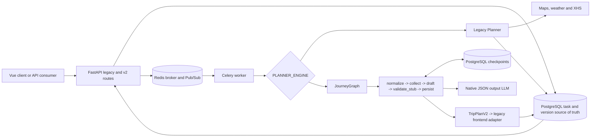

# Phase 3 Acceptance

## Scope

阶段 3 将 legacy 单体 Planner 渐进迁移为可恢复、可切换的 JourneyGraph，同时保持旧 API
和前端响应结构。本文只验收 `docs/DEVELOPMENT_PLAN.md` 的阶段 3，不开始阶段 4。

## Current Architecture



图节点源文件为 `docs/diagrams/journey-graph-phase3.mmd`，由
`python -m backend.scripts.export_journey_graph --output <path>` 从已编译图生成。

## Implementation Matrix

| Plan requirement | Implementation | Evidence |
| --- | --- | --- |
| 1. 隔离旧 Planner | 实现移入 `backend/app/agents/legacy/`，旧模块保留兼容导出 | legacy contract tests |
| 2. State 和节点接口 | `TripState` 和独立 node modules | graph skeleton tests |
| 3. 首批五节点 | `normalize_request -> collect -> draft -> validate_stub -> persist` | compiled graph and node execution tests |
| 4. PostgreSQL Checkpointer | `PostgresSaver`、受限 serializer、初始化脚本 | integration smoke and staging tables |
| 5. 原生结构化输出 | OpenAI-compatible `json_object` 直接校验 `TripPlanV2` | 30-run evaluation |
| 6. 工具返回对象 | collect/draft/validate 边界只传 typed objects | state and node type tests |
| 7. 主路径不修补 JSON | JourneyGraph 只执行 provider request and Pydantic validation | source audit and invalid-output tests |
| 8. legacy 修复链受控 | `LEGACY_JSON_REPAIR=true`，关闭时不执行旧修复链 | flag regression tests |
| 9. 双引擎 Feature Flag | `PLANNER_ENGINE` 与 `PLANNER_COMPARE_ENGINES` | selection and failure-isolation tests |
| 10. 保存对比输出 | primary version 1、comparison version 2，保存 engine/role/schema/native metadata | repository and worker persistence tests |

## Acceptance Matrix

| Acceptance gate | Result | Authoritative evidence |
| --- | --- | --- |
| 图可视化文件生成 | PASS | `docs/diagrams/journey-graph-phase3.mmd` and graph export script |
| 每个节点可独立执行 | PASS | `backend/tests/test_journey_graph_skeleton.py` |
| Checkpoint 可查看和恢复 | PASS | disposable PostgreSQL smoke plus Oracle task `task_e1148a50670d43498ce6` with 7 rows |
| 30 次结构化输出无未捕获 JSON Parse Error | PASS | `docs/evaluations/phase3-structured-output-2026-08-08.json`: 30/30 valid, 0 failures |
| legacy 与 graph 可切换 | PASS | unit selection tests; Oracle worker switched graph -> legacy and remained healthy |
| graph 输出可被现有前端 Adapter 消费 | PASS | adapter tests and real graph response with legacy client contract |

## Feature Flags

| Variable | Safe default | Meaning |
| --- | --- | --- |
| `PLANNER_ENGINE` | `legacy` | Select `legacy` or `journey_graph` as the client-visible primary output |
| `PLANNER_COMPARE_ENGINES` | `false` | Run the non-primary engine in shadow mode and persist version 2 |
| `LEGACY_JSON_REPAIR` | `true` | Temporary legacy-only JSON repair downgrade path |
| `LANGGRAPH_STRICT_MSGPACK` | `true` | Reject checkpoint types outside the explicit allowlist |

Comparison failure is stored as a redacted comparison result and does not fail a successful primary run.
Primary failure cancels outstanding comparison work. These flags are deployment configuration, not request fields.

## Executed Evidence

执行日期为 2026-08-08 Asia/Shanghai。生产容器、生产数据、Caddy 和公网 DNS 未修改。

| Check | Result |
| --- | --- |
| Local Ruff | staged architecture and critical checks passed |
| Local pytest after node-level acceptance tests | `76 passed, 3 skipped`; skipped tests require real PostgreSQL/Redis |
| Graph export reproducibility | generated Mermaid is byte-for-byte identical to the committed diagram |
| GitHub CI | runs `31199315423`, `31201825838`, `31202578603`, `31203240101`, `31204907871`, `31205764332`, `31209573618` passed |
| Structured output evaluation | DeepSeek native JSON output: 30/30 valid, 0 uncaught parse errors, 151.637 seconds |
| Disposable engine smoke | graph output, Adapter, checkpoint and revision `20260808_02` passed |
| Oracle pre-deploy backup | `/var/backups/tripstar/20260807T181543Z-phase3-predeploy`, directory `0700`, files `0600`, SHA-256 passed |
| Oracle deployment | source `909e8ba`, image `journeyops-app:phase3-909e8ba`, migration exit `0` |
| Oracle schema | Alembic `20260808_02`, 4 version metadata columns, 4 checkpoint tables |
| Oracle services | PostgreSQL, Redis, Worker and API healthy; staging and production `/health/ready` passed together |
| Real graph task | completed, one day, client success, legacy client contract, native schema `2.0`, 7 checkpoints |
| Real legacy selection task | legacy path selected; failed safely because upstream rejected the XHS Cookie |
| Secret log audit | configured LLM credential absent from staging API and Worker logs |
| Post-test state | worker restored to `PLANNER_ENGINE=legacy`, comparison disabled, staging worktree clean |

The real legacy selection test reached the unchanged legacy Planner but failed with redacted
`planner_failed` because the XHS Cookie was rejected by upstream risk control. This proves the selected
execution path and failure persistence, but it is not a successful external-provider result. Phase 4 is
responsible for making XHS an optional community provider with fallback behavior.

## Commits

| Commit | Independently working outcome |
| --- | --- |
| `8d02393` | isolate legacy Planner |
| `59d9ee0` | typed JourneyGraph skeleton |
| `2e82ff5` | PostgreSQL checkpoints |
| `ba65a84` | native structured output and 30-run evaluator |
| `1095c22` | legacy JSON repair flag |
| `3a3977c` | legacy frontend Adapter |
| `ca0bc07` | engine switch, shadow comparison and dual-version persistence |
| `909e8ba` | planner error credential redaction |
| `355306f` | explicit independent tests for all five graph nodes |

## Residual Risks

### P1

- Legacy still treats XHS failure as a task failure. Phase 4 must make it optional and add provider fallbacks.
- JourneyGraph `collect` is a typed boundary but does not yet gather source evidence. Phase 4 owns real research.
- The staging branch does not contain the production-only runtime patch for AMap `securityJsCode`; frontend map
  promotion requires a Secret-safe build/runtime variable instead of the current placeholder in `index.html`.
- Old production JSON history is not imported into PostgreSQL. Production promotion remains blocked until a
  repeatable migration and count reconciliation pass in staging.

### P2

- Existing Pydantic v2 and Starlette TestClient deprecation warnings remain.
- GitHub Actions reports that Node.js 20 actions are being forced to Node.js 24.
- Frontend build retains existing large-chunk and unresolved static-resource warnings.

No open P0 issue was found in the stage 3 implementation or staging deployment.

## Rollback

Fast functional rollback requires no database change:

```bash
cd /opt/tripstar/JourneyOps-staging
sed -i 's/^PLANNER_ENGINE=.*/PLANNER_ENGINE=legacy/' .env.staging
sed -i 's/^PLANNER_COMPARE_ENGINES=.*/PLANNER_COMPARE_ENGINES=false/' .env.staging
chmod 0600 .env.staging
docker compose --env-file .env.staging \
  -f docker-compose.yaml -f docker-compose.staging.yaml \
  up -d --no-deps --no-build --force-recreate worker trip-planner
```

For code rollback, create audit-visible revert commits and deploy the resulting pinned image. Do not rewrite
shared history and do not delete volumes. The `20260808_02` columns are additive and may remain during an app
rollback. Downgrade to `20260807_01` only after a verified `pg_dump`, maintenance approval and application
rollback; PostgreSQL checkpoint tables should be retained for forensic and recovery evidence.
