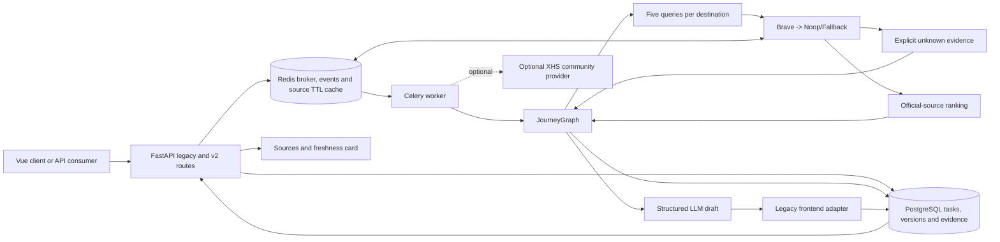

# Phase 4 Acceptance

## Scope

阶段 4 为 JourneyGraph 增加来源化旅行研究和 Provider 降级，并把小红书从必需依赖改为可选
社区来源。本文只验收 `docs/DEVELOPMENT_PLAN.md` 的阶段 4，不开始阶段 5。生产容器、生产数据、
Caddy 和公网 DNS 未修改。

## Current Architecture



## Implementation Matrix

| Plan requirement | Implementation | Evidence |
| --- | --- | --- |
| 1. `WebResearchProvider` | Async Protocol with Provider-neutral request/result models | contract tests |
| 2. Online plus Noop/Fallback | Brave Search Provider, Noop Provider and ordered Fallback chain | Provider tests |
| 3. Official source priority | Explicit allowlist and government-suffix classifier; deterministic trust ordering | ranking tests |
| 4. Persist `SourceEvidence` | Typed model, `source_evidence` table and immutable `trip_source_links` | repository tests and staging rows |
| 5. Five query categories | Opening hours, closures, reservations, events and travel tips per destination | query tests |
| 6. Failure matrix | Safe mappings for 401, 429, timeout, empty body and malformed JSON | `test_research_providers.py` |
| 7. Optional XHS | Disabled Noop default; all XHS errors return safe community fallback | unit and real rejected-Cookie smoke |
| 8. Unknown facts | Four critical query categories create explicit zero-confidence unknown evidence | graph tests and real task |
| 9. Frontend evidence card | Source/trust/status/fetched-time display with safe links and responsive layout | build and browser checks |
| 10. Cache TTL | Memory and Redis implementations; default shared TTL 21600 seconds | unit expiry and staging Redis smoke |

## Acceptance Matrix

| Acceptance gate | Result | Authoritative evidence |
| --- | --- | --- |
| Time-sensitive facts are traceable | PASS | `SourceEvidence` in API, PostgreSQL and UI |
| No search Key still produces a plan | PASS | Oracle task `task_d8eb67c8da724d4b9fe9` completed |
| Expired/rejected XHS Cookie does not fail flow | PASS | real optional-provider status `unavailable`; fixed safe error code |
| Key/Cookie absent from logs, response and trace-safe state | PASS | value-based audit of all configured sensitive environment entries |
| One Provider failure does not fail graph | PASS | 401/429/timeout/empty/malformed tests and fallback tests |
| UI shows sources and fetched time | PASS | desktop and 390x844 browser verification; no console errors |

## Provider And Evidence Policy

- Brave uses the official Web Search endpoint and `X-Subscription-Token`; credentials are read from the
  environment and never stored in request models, graph state or Provider metrics.
- A source is `official` only when its host matches `WEB_RESEARCH_OFFICIAL_DOMAINS` or a recognized government
  suffix. Community results rank below official and major-platform sources.
- Missing non-critical travel tips do not invent evidence. Missing critical opening, closure, reservation or
  event sources create explicit `unknown` records with URL `null`, trust `unknown` and confidence `0`.
- The draft node overwrites model-supplied source fields with graph-owned evidence before Pydantic validation.
- Redis stores serialized evidence under the `journeyops:research:v1` namespace with an explicit TTL.
- XHS context is subjective enrichment only. It is disabled by default and cannot abort the main task.

## Executed Evidence

Execution date: 2026-08-08 Asia/Shanghai.

| Check | Result |
| --- | --- |
| Local pytest | `101 passed, 3 skipped`; skips require real integration services |
| Local frontend build | PASS; existing static-resource and large-chunk warnings remain |
| Compose config | PASS with staging example environment |
| Alembic loop | `20260808_03 -> 20260808_02 -> 20260808_03` on disposable SQLite |
| GitHub CI for implementation commits | run `31231345575` passed |
| Oracle pre-deploy backup | `/var/backups/tripstar/20260808T005836Z-phase4-predeploy`; SHA-256 and Git bundle verified |
| Backup permissions | directory `0700`; dump, environment copy, bundle and manifest `0600` |
| Oracle deployment | source `946cee3`; image `journeyops-app:phase4-946cee3`; migration exit `0` |
| Oracle schema | Alembic `20260808_03`; 4 source rows and 4 version links for the acceptance task |
| Health isolation | staging live/ready `200`; production ready remained `200` |
| Real no-Key task | completed in JourneyGraph; research unavailable; 4/4 evidence records unknown; 0 source URLs; no error |
| Redis cache smoke | write/read succeeded; observed TTL `30`; synthetic key removed afterward |
| Real optional XHS smoke | upstream rejected the configured session; Provider returned safe `unavailable` result |
| Secret audit | all configured Key/Token/Cookie/Password values absent from API/Worker logs and task response |
| Browser verification | desktop and 390x844 source cards rendered; browser console had no error or warning |

The deployed image intentionally excludes pytest. The Provider failure matrix is therefore proven by the local
full suite and GitHub CI, while deployed runtime behavior is proven through health, database, cache, external
XHS degradation and end-to-end task checks.

## Commits

| Commit | Independently working outcome |
| --- | --- |
| `cd8dbea` | typed research contracts and deterministic query generation |
| `600e6e3` | Brave/Noop/Fallback Providers, ranking and TTL caches |
| `81d5d02` | JourneyGraph research nodes and optional community Provider |
| `0675fa4` | source persistence, immutable links and API propagation |
| `946cee3` | responsive source/freshness frontend card |

## Residual Risks

### P0

No open P0 issue was found in the phase 4 implementation or staging deployment.

### P1

- `BRAVE_SEARCH_API_KEY` is not configured in staging, so an actual Brave success response is not yet proven.
  Authentication, rate limiting, timeout, empty and malformed responses are covered with deterministic tests;
  a live success smoke is required before production promotion.
- Old production JSON history is not imported into PostgreSQL. Production promotion remains blocked until a
  repeatable migration and count reconciliation pass is verified in staging.
- The staging branch still lacks a Secret-safe runtime solution for the production-only AMap `securityJsCode`
  patch. Map promotion remains a separate gate.

### P2

- Existing Pydantic v2 and Starlette TestClient deprecation warnings remain.
- Frontend build retains existing unresolved static-resource, mixed dynamic-import and large-chunk warnings.
- Official-domain quality depends on maintaining an accurate allowlist for destination authorities that do not
  use recognized government suffixes.

## Rollback

Fast functional rollback keeps schema and data intact:

```bash
cd /opt/tripstar/JourneyOps-staging
sed -i 's/^PLANNER_ENGINE=.*/PLANNER_ENGINE=legacy/' .env.staging
sed -i 's/^PLANNER_COMPARE_ENGINES=.*/PLANNER_COMPARE_ENGINES=false/' .env.staging
sed -i 's/^XHS_ENABLED=.*/XHS_ENABLED=false/' .env.staging
chmod 0600 .env.staging
docker compose --env-file .env.staging \
  -f docker-compose.yaml -f docker-compose.staging.yaml \
  up -d --no-deps --no-build --force-recreate worker trip-planner
```

Create audit-visible revert commits for code rollback; do not rewrite shared history or delete volumes. The
additive `20260808_03` tables may remain during application rollback, but rollback source must retain the
revision file while the database reports that revision. Do not run the phase 3 migrate image against a phase 4
database. Schema downgrade to `20260808_02` deletes all source evidence and links and therefore requires a
verified backup, maintenance approval and stopped API/Worker containers.
