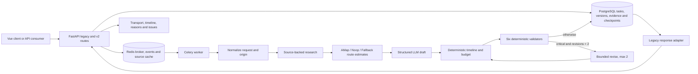

# Phase 5 Acceptance

## Scope

阶段 5 把 JourneyGraph 从目的地内容生成升级为带出发地、城际交通、闭合时间轴、程序预算和
确定性校验/修订的可执行行程。本文只验收 `docs/DEVELOPMENT_PLAN.md` 的阶段 5，不开始阶段 6。
生产容器、生产数据、Caddy 和公网 DNS 未修改。

## Current Architecture



The LLM only proposes a structured draft. The graph restores request-owned identity and evidence, while
deterministic code owns route metadata, schedule identifiers/times, budget arithmetic, validation results and
the revision limit.

## Implementation Matrix

| Plan requirement | Implementation | Evidence |
| --- | --- | --- |
| 1. Add `origin` end to end | Required v2 field, legacy-compatible fallback, adapters and localized forms | model/API/form tests and real task |
| 2. Intercity transport model | Up to two options per leg, exactly one recommended, explicit estimate caveats | domain and transport-node tests |
| 3. Route/distance capability | Provider contract with AMap, Noop and ordered fallback | Provider tests and live route smoke |
| 4. Executable daily items | `item_id`, `item_type`, `start`, `end`, `duration_minutes` and route references | enrichment tests and real timeline |
| 5. Six validators | structure/date, time, route, budget, opening hours and intensity | validator unit matrix |
| 6. Program budget | Transport, accommodation, food, attractions and miscellaneous components are recomputed and summed | budget tests and real response |
| 7. Validation enters revise | Critical reports conditionally route to `revise_plan` | graph routing tests |
| 8. Maximum two revisions | Typed `revision_count` with graph guard and unresolved issue persistence | revision tests |
| 9. Frontend severity display | Summary and critical/warning/info issue cards with day badges | production build and browser checks |
| 10. Arrangement rationale | Overview transport explanation and per-day rationale | desktop/mobile browser checks |

## Deterministic Validators

| Validator | Main checks | Revision behavior |
| --- | --- | --- |
| Structure and date | request window, day count/city allocation, transfer markers, duplicate attractions and item IDs | restores identity and removes structural conflicts |
| Time | daily start/end, exact duration, overlap/gap, meal windows and day boundaries | rebuilds a contiguous day and adds explicit buffer |
| Route | route references/status, leg duration, excessive transfer/walking and city transitions | replaces impossible or mismatched route items |
| Budget | component sum, per-person total and requested ceiling | removes lower-priority cost or fixes arithmetic |
| Opening hours | closed/unknown evidence and scheduled attraction conflicts | removes a confirmed closed attraction |
| Intensity | activity count, active minutes and user pace limits | drops lower-priority activities and preserves buffer |

## Acceptance Matrix

| Acceptance gate | Result | Authoritative evidence |
| --- | --- | --- |
| Explicit origin-to-destination advice | PASS | real Beijing-to-Shanghai task recommends an estimated train option |
| Every daily timeline closes | PASS | both days cover `09:00` through `20:00` contiguously; durations match start/end |
| Program budget is internally consistent | PASS | components `0 + 0 + 0 + 0 + 603`, total `603` |
| Closed-attraction conflict is found/revised | PASS | deterministic closed-evidence validator and revise tests |
| Obviously infeasible route is found | PASS | route status/duration/reference tests; intercity mode regression fixed |
| Final critical issues are absent or explicit | PASS | real task has zero issues; tests persist unresolved criticals after two revisions |
| No fabricated service or live inventory | PASS | recursive response audit found no train/flight/service number, availability or remaining-ticket fields |

## Executed Evidence

Execution date: 2026-08-08 Asia/Shanghai.

| Check | Result |
| --- | --- |
| Local pytest | `122 passed, 3 skipped`; 17 existing deprecation warnings |
| Local Ruff | staged architecture and critical existing-backend checks passed |
| Local frontend build | PASS; existing static-resource, mixed-import and large-chunk warnings remain |
| GitHub implementation CI | run `31241413676` passed for source `147d93b` |
| Oracle pre-deploy backup | `/var/backups/tripstar/20260808T041757Z-phase5-predeploy` |
| Backup verification | directory `0700`, five files `0600`, all SHA-256 entries and Git bundle passed; pg_dump catalog readable |
| Oracle deployment | source `147d93b`; image `journeyops-app:phase5-147d93b`; migrate exit `0` |
| Oracle schema | Alembic `20260808_03 (head)`; phase 5 adds no migration |
| Health isolation | staging API/Worker healthy and ready `200`; production ready stayed `200`, response hash unchanged, restart count `0` |
| Real task | `task_6c97534bd3d148bd97ca`; JourneyGraph schema `2.0`; one immutable version |
| Real transport | recommended `train:estimated`, `422` minutes; AMap distance `1,205,561` meters |
| Real timeline | day item counts `2` and `1`; both `09:00-20:00`, contiguous and duration-exact |
| Real budget | total and per-person `603`; all component arithmetic matched |
| Real validation | 0 critical, 0 warning, 0 info; `revision_count=0` |
| Provider caveat audit | no exact service number, live availability, remaining tickets or live fare fields |
| Secret audit | six sensitive names scanned, five non-empty values checked, zero matches in route output, API/Worker logs and response |
| Browser verification | desktop and 375px effective mobile viewport rendered route, budget, timeline, rationale and no-issue state; no overflow or console errors |

The real task used the configured DeepSeek planner and AMap route service. Phase 5 route options intentionally
remain planning estimates: AMap supplies a verified driving distance/duration baseline, while train/flight
duration and cost are deterministic heuristics without service numbers, schedules, inventory or live fares.

## Commits

| Commit | Independently working outcome |
| --- | --- |
| `6e2c454` | explicit trip origin across contracts, adapters and forms |
| `6220e6a` | route Provider chain and intercity transport options |
| `4fab966` | deterministic closed timelines and recalculated budgets |
| `72a7d88` | six deterministic itinerary validators |
| `8a5fde6` | bounded validation/revision loop |
| `0edb320` | responsive transport, timeline, rationale and validation UI |
| `20b77e7` | phase 5 CI lint compatibility |
| `1b0e27c` | request identity cannot be overwritten by model drafts |
| `2a20773` | intercity duration validation uses the selected transport mode |
| `147d93b` | credential-bearing HTTP request URLs are suppressed from INFO logs |

## Residual Risks

### P0

No open P0 issue was found in the phase 5 implementation or staging deployment.

### P1

- `BRAVE_SEARCH_API_KEY` is not configured in staging, so a live Brave success response remains unproven.
  The real task safely used `unknown` evidence where research was unavailable.
- Old production JSON history is not imported into PostgreSQL. Production promotion remains blocked until a
  repeatable staging import and count reconciliation pass is complete.
- AMap provides a driving baseline only. Intercity train/flight options are useful estimates but are not tied
  to official schedules, live fares or availability; a future ticketing Provider is required for booking-grade data.
- The production-only AMap `securityJsCode` behavior still needs a Secret-safe merge into JourneyOps before
  promotion; no security code may be committed or returned through a public settings endpoint.

### P2

- Existing Pydantic v2 and Starlette TestClient deprecation warnings remain.
- Frontend build retains existing unresolved static-resource, mixed dynamic-import and large-chunk warnings.
- GitHub Actions reports that Node.js 20 actions are currently forced to Node.js 24; workflow actions should be
  upgraded before that compatibility bridge is removed.
- With Brave unavailable, verified POI/weather content can remain empty even though the executable transport,
  timeline, budget and validation flow succeeds.

## Rollback

Fast functional rollback keeps schema and data intact:

```bash
cd /opt/tripstar/JourneyOps-staging
sed -i 's/^PLANNER_ENGINE=.*/PLANNER_ENGINE=legacy/' .env.staging
sed -i 's/^PLANNER_COMPARE_ENGINES=.*/PLANNER_COMPARE_ENGINES=false/' .env.staging
sed -i 's/^XHS_ENABLED=.*/XHS_ENABLED=false/' .env.staging
chmod 0600 .env.staging
docker compose --env-file .env.staging \
  -f docker-compose.yaml -f docker-compose.staging.yaml \
  up -d --no-deps --no-build --force-recreate worker trip-planner
```

Phase 5 adds no database migration, so Alembic remains at `20260808_03`. Use audit-visible revert commits for
code rollback and keep all volumes. If an image rollback is required, pin a previously verified image while
retaining a source tree that contains revision `20260808_03`; do not run an older migrate image that does not
recognize the current revision. Database restoration is destructive and may only target an explicitly isolated
restore-drill stack after verifying `/var/backups/tripstar/20260808T041757Z-phase5-predeploy`.

## Phase Boundary

Phase 5 is complete. Human approval, dynamic replanning, version diff and rollback from phase 6 have not been
started and require an explicit next-stage instruction.
