# Phase 6 Acceptance

## Scope

阶段 6 为 JourneyGraph 增加持久人工审核、局部动态重规划、结构化差异和不可变版本回滚。
本文只验收 `docs/DEVELOPMENT_PLAN.md` 的阶段 6，不开始阶段 7。生产容器、生产数据、Caddy
和公网 DNS 均未修改。

## Current Architecture

```mermaid
flowchart LR
    Client["Vue review and version workspace"]
    API["FastAPI v2 review/version API"]
    DB[("PostgreSQL tasks, reviews, versions and active pointer")]
    Redis[("Redis broker and events")]
    Worker["Celery worker"]
    Journey["JourneyGraph"]
    InitialInterrupt["Initial review interrupt"]
    Replan["ReplanGraph"]
    Impact["Impact scope analysis"]
    Refresh["Selective research/routing refresh"]
    Validate["Deterministic validate/revise"]
    Diff["Structured diff"]
    ReplanInterrupt["Replan review interrupt"]
    Version["Immutable approved version"]
    Rollback["Rollback as a new version"]

    Client --> API
    API --> DB
    API --> Redis
    Redis --> Worker
    Worker --> Journey
    Journey --> InitialInterrupt
    InitialInterrupt -->|"approve"| Version
    InitialInterrupt -->|"modify"| Replan
    InitialInterrupt -->|"reject"| DB
    Version --> Replan
    Replan --> Impact
    Impact --> Refresh
    Refresh --> Validate
    Validate --> Diff
    Diff --> ReplanInterrupt
    ReplanInterrupt -->|"approve"| Version
    ReplanInterrupt -->|"modify"| Impact
    ReplanInterrupt -->|"reject"| DB
    Version --> Rollback
    Rollback --> Version
    DB --> API
    API --> Client
```



PostgreSQL is the review and version source of truth. LangGraph checkpoints preserve graph continuation
state; Redis only dispatches work and publishes progress. A proposal never advances `active_version` until an
approval is applied. Rejecting a replan preserves the existing active version and completed result.

## Implementation Matrix

| Plan requirement | Implementation | Evidence |
| --- | --- | --- |
| Initial plan interrupt | JourneyGraph ends at a durable human-review node | unit tests and real pending task |
| Approve, modify and reject | one persisted decision endpoint with state-aware continuation | API tests and real workflow |
| Replan Graph | dedicated typed graph separate from legacy Planner | graph tests and source audit |
| Impact scope detection | affected days, fields and refresh flags are explicit | real day-1 transport change |
| Refresh only required data | research/routing refresh follows impact flags | focused node tests and real scope |
| Structured diff | JSON-path entries plus changed/unchanged day indexes | API compare and browser view |
| Save only after approval | pending proposal creates zero versions; approval creates one | restart and version-count checks |
| Version rollback | restore creates a new immutable `rollback` version | V1 to V3 real rollback |
| Frontend version/diff view | review console, version history, compare and rollback UI | desktop and mobile browser checks |
| Restart-safe review | PostgreSQL review record plus PostgreSQL LangGraph checkpoint | API/Worker restart acceptance |

## API And State Contract

| Endpoint | Purpose |
| --- | --- |
| `GET /api/v2/trips/tasks/{task_id}` | read task, proposal and current review state |
| `POST /api/v2/trips/tasks/{task_id}/review` | approve, modify, reject or begin a replan |
| `GET /api/v2/trips/{trip_id}/reviews` | list immutable review audit records |
| `GET /api/v2/trips/{trip_id}/versions` | list immutable versions and active pointer |
| `GET /api/v2/trips/{trip_id}/versions/{version}` | read one version payload and audit metadata |
| `GET /api/v2/trips/{trip_id}/versions/{from}/compare/{to}` | compute structured version diff |
| `POST /api/v2/trips/{trip_id}/versions/{version}/rollback` | restore history as a new active version |

`awaiting_approval` is non-terminal and remains readable after page/API/Worker restarts. Initial rejection is a
terminal rejection because no accepted plan exists. Replan rejection returns the task to `completed` with its
previous result. A no-op proposal cannot be approved and returns `409` instead of creating a meaningless version.

## Real Acceptance Flow

Execution date: 2026-08-08 Asia/Shanghai.

The staging task was `task_eade1a7c36ce44cc9b63` for trip `trip_f0e46c5355fa4dc6b502`. The configured
DeepSeek planner was called. Because live research was unavailable, content safely degraded to unknown-source
planning data; review, checkpoint, validation, diff and version behavior remained fully testable.

| Step | Result |
| --- | --- |
| Generate initial proposal | task entered `awaiting_approval`; initial review pending; version count `0` |
| Restart while pending | API and Worker restarted; task/review remained pending; version count stayed `0` |
| Approve initial proposal | task completed; review applied; V1 `primary` became active |
| Attempt ineffective replan | diff had zero entries; approval returned `409`; no version created |
| Modify pending request | day index `1`, field `transport`; routing refresh enabled; 2 diff entries |
| Verify selective update | day index `0` remained unchanged; version count stayed `1` before approval |
| Approve scoped replan | V2 `replan` became active; reason, source list and validation report persisted |
| Compare V1 and V2 | changed days `[1]`, unchanged days `[0]`, 2 structured entries |
| Roll back to V1 | V3 `rollback` became active; V3 native payload matched V1; V1/V2 remained immutable |
| Reject later replan | review became rejected; task returned to completed; active V3 and version count `3` remained |

Rollback V3 records `version:1` as its source. Replans that do not refresh external research retain an explicit
empty source list rather than inventing evidence. Every applied version stores a reason and validation report.

## Browser Acceptance

The deployed staging result page was opened through a temporary read-only SSH tunnel.

| View | Result |
| --- | --- |
| Desktop 1280 x 720 | review console, draft V4, impact chips, approve/modify/reject and version history rendered |
| Version history | V1 primary, V2 scoped replan and active V3 rollback rendered; compare/restore controls visible |
| Mobile 390 x 844 | effective width `375`; review controls stacked; all button bounds inside viewport |
| Overflow | `scrollWidth=375`, `clientWidth=375`; no horizontal overflow |
| Edit boundary | task-backed pages hide legacy local-only editing and route changes through review/version APIs |

The first mobile pass found the reject button clipped by a single-row action group. Commit `011a485` changed
the review actions to full-width stacked controls; the deployed page then passed the coordinate and screenshot
retest.

## Executed Evidence

| Check | Result |
| --- | --- |
| Local pytest | `127 passed, 4 skipped, 17 warnings` |
| Local Ruff | all phase 6 changed Python files passed; repository-wide legacy baseline still has 169 findings |
| Local frontend build | PASS; existing static-resource, mixed-import and large-chunk warnings remain |
| Focused human-review tests | `5 passed` |
| GitHub CI | run `31248988084`; Python and Frontend jobs passed for `011a485` |
| Oracle pre-deploy backup | `/var/backups/tripstar/20260808T080347Z-phase6-predeploy` |
| Backup verification | directory `0700`, files `0600`; SHA-256, Git bundle and pg_dump catalog passed |
| Oracle deployment | application source `011a485`; image `journeyops-app:phase6-011a485` |
| Oracle schema | Alembic `20260808_04 (head)`; migrate exit `0` |
| Staging health | PostgreSQL, Redis, Worker and API healthy; live/ready both `200` |
| Secret audit | 3 configured non-empty sensitive values checked; zero matches in response and API/Worker logs |
| Log audit | zero traceback lines and zero error-level lines in the acceptance window |
| Production isolation | container ID unchanged; restart count `0`; ready `200`; response SHA-256 unchanged |

The four local integration tests are skipped without `TEST_DATABASE_URL` and `TEST_REDIS_URL`; the GitHub Python
job supplies PostgreSQL and Redis, applies migrations, initializes checkpoints and passed the same suite.

## Commits

| Commit | Independently working outcome |
| --- | --- |
| `6d0fe24` | durable initial review, ReplanGraph, immutable versions, rollback and restart recovery |
| `6e51bed` | frontend review, structured diff and version workspace |
| `16aa716` | block no-op replan approvals |
| `2cd94b6` | preserve the active result when a replan is rejected |
| `3fd4c4b` | route task-backed edits through the review workflow |
| `011a485` | make all review actions usable on mobile |

## Residual Risks

### P0

No open P0 issue was found in the phase 6 implementation or staging deployment.

### P1

- Old production JSON history is not imported into PostgreSQL. Production promotion remains blocked until a
  repeatable staging import and count reconciliation pass is complete.
- `BRAVE_SEARCH_API_KEY` is not configured in staging, so a live successful research refresh remains unproven.
- The production-only AMap `securityJsCode` behavior still requires a Secret-safe merge before promotion.

### P2

- Existing Pydantic v2 and Starlette TestClient deprecation warnings remain.
- The repository-wide Ruff baseline includes legacy code that this phase was explicitly forbidden to rewrite.
- Frontend build retains unresolved static-resource, mixed dynamic-import and large-chunk warnings.
- GitHub Actions reports that Node.js 20 actions are forced to Node.js 24; workflow actions should be upgraded.

## Rollback

Application rollback should first pin the previous verified image while retaining the phase 6 database schema.
The prior application image cannot run its own migrate service because it does not know revision `20260808_04`;
replace only API/Worker or use a source tree that retains the phase 6 revision file.

Schema downgrade is destructive because it removes all review records, active-version pointers and version audit
metadata. It requires a verified `pg_dump`, a maintenance window and explicit approval:

```bash
cd /opt/tripstar/JourneyOps-staging
docker compose --env-file .env.staging \
  -f docker-compose.yaml -f docker-compose.staging.yaml \
  stop trip-planner worker
docker compose --env-file .env.staging \
  -f docker-compose.yaml -f docker-compose.staging.yaml \
  run --rm migrate alembic -c backend/alembic.ini downgrade 20260808_03
```

Do not use `docker compose down -v`. Restore drills may only target an explicitly isolated stack and the verified
phase 6 backup. LangGraph checkpoint tables are not removed by the Alembic downgrade.

## Phase Boundary

Phase 6 is complete. Evaluation, observability, access controls and cost governance from phase 7 have not been
started and require an explicit next-stage instruction.
