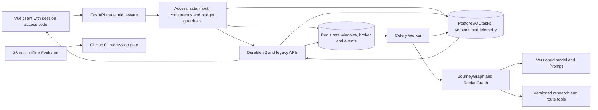

# Phase 7 Acceptance

## Scope

阶段 7 为 JourneyOps 增加可复现离线评测、运行版本清单、端到端 trace、持久脱敏遥测和模型费用
防护。本文只验收 `docs/DEVELOPMENT_PLAN.md` 的阶段 7，不开始阶段 8。legacy
`backend/app/agents/legacy/trip_planner_agent.py` 未修改；生产容器、生产数据、Caddy 和 DNS 未修改。

## Current Architecture



`trace_id` is persisted on the task and returned in the response Header/body. Worker events carry the same
`trace_id`, `task_id` and `trip_id`. PostgreSQL is the telemetry source of truth; payloads, prompts, model output,
authorization data and credentials are excluded. Redis rate-limit failures fail closed with `503`.

## Implementation Matrix

| Plan requirement | Implementation | Evidence |
| --- | --- | --- |
| 30+ realistic cases | pinned 36-case travel/fault/replan/security dataset | dataset contract test |
| Code Evaluator | versioned Pydantic evaluator and CLI runner | offline CI artifact |
| Engine comparison | exactly one legacy and Graph observation per case | 28/36 versus 35/36 baseline |
| Runtime versions | model, Prompt, workflow and tool versions on immutable versions | API and repository tests |
| Usage metrics | input/output/total tokens, cost, latency, retry and cache hit | live DeepSeek telemetry |
| Failure localization | component, node, tool, status and error code | live `research/noop` events |
| Trace correlation | Header to task, Worker, node and tool | live trace and unit tests |
| Access and rate limit | constant-time access code and Redis fixed window | live 401 and 429 checks |
| Input/concurrency/budget | byte/list/item bounds, active task and worst-case model budget | 413/422/429 tests |
| Prompt Injection baseline | explicit instruction override/Secret extraction patterns | live 422 and unit tests |
| No external observability SaaS | PostgreSQL telemetry; no LangSmith/Langfuse Secret | schema and API audit |
| No Secret logging | recursive metadata redaction plus log/response scan | zero live matches |

## Offline Evaluation

Dataset `journeyops-travel-v1.0.0`, evaluator `journeyops-evaluator/1.0.0`, fixture
`journeyops-offline-observations/1.0.0` and seed `20260808` are pinned in the repository.

| Engine | Passed | Pass rate | Fixture latency | Fixture cost |
| --- | ---: | ---: | ---: | ---: |
| legacy | 28 / 36 | 77.78% | 120,000 ms | USD 6.84 |
| journey_graph | 35 / 36 | 97.22% | 91,000 ms | USD 5.04 |

CI requires both engines to remain at or above the truthful initial floor of 75%. It uploads the JSON report as
an artifact. All eight legacy failures and the one JourneyGraph community-tool failure remain listed in
`docs/EVALUATION_REPORT.md`; no failure was removed to make the baseline green.

## Guardrail Acceptance

The staging API is bound to `127.0.0.1:17861`, so its steady-state app access-code flag remains false. During
acceptance, a random temporary code was generated only on the host, the API was recreated, and the original
configuration was restored automatically.

| Check | Real result |
| --- | --- |
| Missing access code while required | `401` |
| Valid code plus injection text | `422` before task creation |
| Valid code plus forced 1,024-token budget | `429` before task creation |
| Second Redis call in one-request window | `429` |
| Restored steady state | access-code required false; access-code value empty |
| Public production protection | existing Caddy Basic Auth unchanged; app code must be enabled before promotion |

Rate-limit identities are SHA-256 digests of the access code or client IP and never contain the raw identity.
Redis outage returns `503`, rather than allowing unlimited model calls.

## Live Model And Trace Acceptance

Execution date: 2026-08-08 Asia/Shanghai. The provider was DeepSeek official OpenAI-compatible API with model
`deepseek-v4-flash`. Input cost uses the conservative official cache-miss rate of USD 0.14 per million tokens;
output cost uses USD 0.28 per million tokens. The source is the
[official DeepSeek pricing page](https://api-docs.deepseek.com/quick_start/pricing), checked on 2026-08-08.
Prices live only in the host's untracked environment and must be reviewed when the provider changes them.

| Item | Result |
| --- | --- |
| Cost task | `task_55f014040af94515b5a2`, trip `trip_3e34b7c4e5544b998c04` |
| Correlation | server-issued trace persisted and returned across API/Worker/Graph |
| Model usage | input 5,118; output 7,937; total 13,055 tokens |
| Calculated cost | USD 0.00293888 |
| Model latency | 56,579 ms |
| Runtime manifest | `deepseek-v4-flash`, `trip-plan-v2/2026-08-08`, `journey-graph/phase7` |
| Review boundary | proposal reached `awaiting_approval`; version count remained 0 |
| Resume accounting | events `[engine_run, engine_resume]`; total tokens and cost unchanged |
| Final state | reviewer rejection produced terminal `rejected`; no version activated |

An earlier live task used caller trace `trace_phase7_live_20260808`, recorded 20,514 tokens and five failed Noop
research calls, each localized to node `research` and tool `noop`. No Brave credential is configured, so this is
expected safe degradation rather than a hidden successful research claim.

## Executed Evidence

| Check | Result |
| --- | --- |
| Local pytest | `139 passed, 4 skipped` |
| Local Ruff | all staged architecture paths passed |
| Local frontend build | PASS; existing static-resource/mixed-import/chunk warnings remain |
| Compose rendering | PASS |
| GitHub CI | `31253092858`; Python and Frontend jobs passed for `2634e73` |
| CI database | PostgreSQL migration `20260808_05`, Redis integration and offline artifact passed |
| Oracle backup | `/var/backups/tripstar/20260808T102339Z-phase7-predeploy` |
| Backup verification | directory `0700`, files `0600`; SHA-256, Git bundle and pg_dump catalog passed |
| Oracle deployment | source `2634e73`; image `journeyops-app:phase7-2634e73` |
| Oracle schema | Alembic `20260808_05`; migrate exit `0` |
| Staging health | PostgreSQL, Redis, Worker and API healthy; live/ready `200` |
| Secret audit | 3 configured sensitive values; zero matches in telemetry and API/Worker logs |
| Log audit | zero traceback lines and zero error-level lines in the acceptance window |
| Production isolation | container ID/image unchanged; restart count `0`; ready hash unchanged |

The four local integration tests skip without `TEST_DATABASE_URL` and `TEST_REDIS_URL`; GitHub CI provides real
PostgreSQL/Redis and passed them. Existing Pydantic and Starlette warnings are not phase 7 regressions.

## Commits

| Commit | Independently working outcome |
| --- | --- |
| `f1fda77` | 36-case dataset, versioned Evaluator, two-engine fixture and CI artifact |
| `e5464d1` | trace propagation, runtime manifests, PostgreSQL telemetry and migration |
| `dd8dd13` | access code, rate, input, concurrency, token/cost and injection guardrails |
| `b0f2855` | evaluation, API and deployment operating documentation |
| `2634e73` | prevent token/cost duplication when a graph resumes after review |

## Residual Risks

### P0

No open P0 issue was found in the phase 7 implementation or staging deployment.

### P1

- App-level access code is intentionally disabled on loopback-only staging. Before any direct public promotion,
  enable it with an independent Secret and verify the frontend session-code flow; current production remains behind
  unchanged Caddy Basic Auth.
- DeepSeek pricing can change. The host rates reflect the official page checked on 2026-08-08 and require periodic
  review; cache hits are conservatively charged as misses because the compatible response does not expose a reliable
  billing cache classification.
- `BRAVE_SEARCH_API_KEY` is absent, so a real successful web-research path remains unverified.
- Old production JSON history is not imported into PostgreSQL; production promotion remains blocked.

### P2

- Prompt Injection detection is a bounded first-line filter, not a complete semantic defense. Tool allowlists,
  schema validation and Secret separation remain the primary controls.
- Existing Pydantic v2, Starlette TestClient, static-resource and frontend chunk warnings remain.
- Optional LangSmith/Langfuse integration was not added; PostgreSQL telemetry is currently sufficient.

## Rollback

Prefer application rollback to `journeyops-app:phase6-011a485` while retaining schema `20260808_05`. A rollback
source tree must retain the phase 7 migration file, or replace only API/Worker with `--no-deps --no-build` so the old
migrate service is not executed. Do not use `docker compose down -v`.

Schema downgrade deletes all phase 7 telemetry, trace IDs and version runtime manifests. It requires explicit
approval, the verified phase 7 backup and a maintenance window:

```bash
cd /opt/tripstar/JourneyOps-staging
docker compose --env-file .env.staging \
  -f docker-compose.yaml -f docker-compose.staging.yaml \
  stop trip-planner worker
docker compose --env-file .env.staging \
  -f docker-compose.yaml -f docker-compose.staging.yaml \
  run --rm migrate alembic -c backend/alembic.ini downgrade 20260808_04
```

Restore drills may target only a new isolated stack. Production volumes and old JSON files must not be overwritten.

## Phase Boundary

Phase 7 is complete. Phase 8 migration, production shadow traffic and production promotion have not started and
require a separate explicit instruction.
